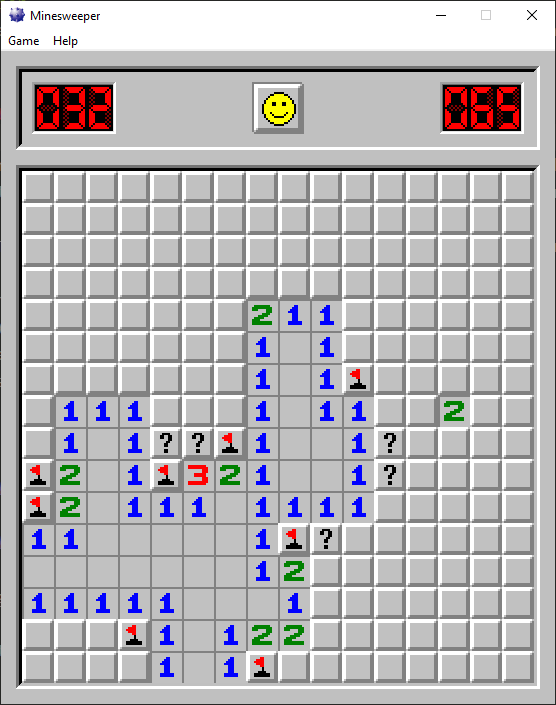

# Minesweeper
 A 2x scale replica of the original Windows Minesweeper, made with python and tkinter and using 
 resources from the original game.

> _"Too many mines, not enough sweepers."_

Minesweeper will run no worries on python >= 3.6, I haven't tested with versions below this, 
but given that Pillow >= 8.0 only supports >= 3.6, that's what I'm gonna go with.

**NOTE:** To run the game, you will need the following python modules installed:
- Pygame
- Python Imaging Library (PIL)
- Tkinter (installed by default)
- Webbrowser (installed by default)
- OS (installed by default)

So you may have to do this:

`pip install pygame`

`pip install Pillow`

If you're going to download this repository to import into you're own code, download the minesweeper folder (__not__ the root folder, Minesweeper).

If you just want to play the game, download the entire repository and start the game using run.py

Happy sweeping!

Caleb Webster

Files:
- __minesweeper/best_times.csv__ - stores fastest completion times/names for beginner, intermediate, and expert levels.
- __minesweeper/core.py - core__ Minesweeper game functionality. Keeps track of tiles, bombs, numbers, clicking and marking tiles, resetting game, winning and losing.
- __minesweeper/dialogs.py__ - custom Tkinter dialog boxes for custom difficulty, best times, player name, etc.
- __minesweeper/main.py__ - Tkinter-based GUI Application that controls core game.
- __minesweeper/tile.py__ - Tile class, used by core game to store information of a tile, such as number, mark, and whether or not the tile is safe.
- __run.py__ - imports and runs MinesweeperApp class from minesweeper/main.py, making playing the game easier and faster.
